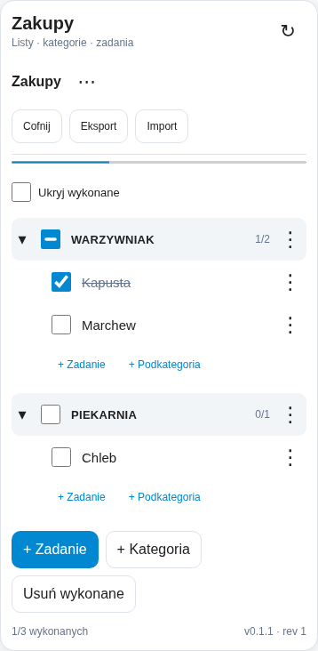

# Hierarchical Tasks 0.1.1

Lokalne listy z kategoriami, podkategoriami i zadaniami dla Home Assistant.
W pakiecie: integracja Python, własna karta dashboardu, testy i przykłady.
Licencja MIT. Brak zewnętrznych bibliotek frontendowych i połączeń z chmurą.



## Instalacja przez HACS

**Masz pliki ZIP, ale nie masz jeszcze repozytorium?** Zobacz
[PUBLISHING_HACS.md](PUBLISHING_HACS.md): utwórz publiczne repozytorium GitHub,
wgraj zawartość projektu, uruchom **Prepare repository**, a następnie **Validate**.
Adresy i login zostaną dopasowane do Twojego repozytorium, bez ręcznej edycji kodu.

Następnie dodaj repozytorium w HACS jako **Integration**, pobierz i zrestartuj HA.
Konfiguracja integracji oraz karty: [INSTALLATION.md](INSTALLATION.md).
Karta jest częścią integracji; nie potrzebuje osobnego repozytorium Dashboard.
Wszystkie pliki niezbędne do działania są w `custom_components/hierarchical_tasks`.

Wymagana wersja zadeklarowana w `hacs.json`: **Home Assistant 2026.9.0+**.

## Status wydania

**Wersja testowa 0.1.1. Zmiana dotyczy przygotowania publikacji w HACS,
nie modelu list ani formatu zapisanych danych.**

Poprzednim punktem odniesienia adapterów pozostaje HA 2026.9.0.
Ponowiono testy jednostkowe i 14 scenariuszy przeglądarkowych oraz dodano
testy metadanych i pakowania. Aktualne wyniki: [TESTING.md](TESTING.md).
Połączenie HA w testach przeglądarkowych jest symulowane.

**Nie uruchomiono pełnej integracji w prawdziwym HA ani instalacji w HACS.**
Oficjalne walidatory HACS/hassfest uruchomisz przez workflow po publikacji
na GitHub. Lokalny walidator nie zastępuje tych sprawdzeń.
Przed instalacją wykonaj kopię zapasową konfiguracji HA.

## Model i zakres

```text
Zakupy                         <- lista
  WARZYWNIAK                   <- kategoria, checkbox zbiorczy
    Kapusta                    <- zadanie z własnym checkboxem
    Marchew                    <- zadanie z własnym checkboxem
    NA ZUPĘ                    <- podkategoria
      Por                      <- zadanie
  PIEKARNIA
    Chleb
```

Kategorie są kontenerami. Zadania są liśćmi drzewa i mają własny stan.
Złożoną czynność, np. „Remont kuchni”, tworzysz jako kategorię
z zadaniami. Nie ma drugiego, niezależnego stanu wykonania samej kategorii.

Checkbox kategorii ma trzy stany: nic, część, wszystko. Kliknięcie stanu
częściowego zaznacza pozostałe zadania; kliknięcie pełnego odznacza wszystkie.
Pusta kategoria ma wyłączony checkbox. Liczniki uwzględniają zadania,
nie kategorie, i obejmują całe poddrzewo bez podwójnego liczenia.

Dostępne są: wiele list, zagnieżdżone kategorie, dodawanie, zmiana nazwy,
usuwanie, przenoszenie między kategoriami i listami, kolejność ręczna,
zwijanie, ukrywanie wykonanych, usuwanie wykonanych z zachowaniem kategorii,
cofanie, eksport/import oraz akcje automatyzacji.

Na komputerze działa drag-and-drop. Upuszczenie na kategorię przenosi element
na jej koniec; na zadanie — przed to zadanie; na pole pod drzewem — na poziom
główny. Na telefonie i z klawiatury użyj menu elementu: Przenieś / Wyżej / Niżej.

Limity ochronne: **30 list, łącznie 2000 elementów, 16 poziomów drzewa,
200 znaków w nazwie, 2 000 000 bajtów pliku danych/importu**.
Limit poziomów obejmuje kategorię lub zadanie na danym poziomie; korzeń listy
nie jest elementem. Stan rozwinięcia i filtr są lokalne dla danej karty.

## 1. Instalacja ręczna - alternatywa dla HACS

Przy instalacji przez HACS pomiń kopiowanie plików i przejdź do kroku 2.
Jednorazowe metadane repozytorium uzupełnij według `PUBLISHING_HACS.md`.

Rozpakuj ZIP na komputerze. Z katalogu projektu skopiuj CAŁY folder:

```text
custom_components/hierarchical_tasks
```

do katalogu konfiguracji Home Assistanta:

```text
/config/custom_components/hierarchical_tasks
```

To katalog obok `configuration.yaml`. W instalacji Container skopiuj pliki
do odpowiadającego mu katalogu hosta. Nie trzeba zmieniać obrazu kontenera.

Prawidłowa struktura:

```text
/config/custom_components/hierarchical_tasks/__init__.py
/config/custom_components/hierarchical_tasks/manifest.json
/config/custom_components/hierarchical_tasks/config_flow.py
/config/custom_components/hierarchical_tasks/const.py
/config/custom_components/hierarchical_tasks/model.py
/config/custom_components/hierarchical_tasks/storage.py
/config/custom_components/hierarchical_tasks/runtime.py
/config/custom_components/hierarchical_tasks/websocket.py
/config/custom_components/hierarchical_tasks/services.py
/config/custom_components/hierarchical_tasks/services.yaml
/config/custom_components/hierarchical_tasks/strings.json
/config/custom_components/hierarchical_tasks/translations/pl.json
/config/custom_components/hierarchical_tasks/translations/en.json
/config/custom_components/hierarchical_tasks/frontend/hierarchical-tasks-card.js
```

Nie twórz dodatkowego zagnieżdżenia typu
`custom_components/ha-hierarchical-tasks/custom_components/...`.
Nie instaluj bibliotek przez pip/npm w swoim HA. Wszystkie importy integracji
pochodzą z Pythona lub Home Assistanta, a karta jest gotowym plikiem JavaScript.

Wykonaj **pełny restart Home Assistant**. Samo odświeżenie dashboardu nie wystarczy.

## 2. Dodaj integrację przez interfejs HA

Otwórz **Ustawienia > Urządzenia i usługi > Dodaj integrację**.
Wyszukaj **Hierarchical Tasks**.

Zaznaczenie przykładu utworzy listę `zakupy`, kategorie `warzywniak` i
`piekarnia` oraz zadania `kapusta`, `marchew`, `chleb`.
Bez przykładu powstanie pusta lista `zakupy`. Przykład jest tworzony tylko,
gdy plik danych jeszcze nie istnieje.

Domyślnie udostępnianie jest wyłączone i dostęp mają tylko administratorzy.
Opcję można zmienić również później w opcjach integracji.

**Integracja nie tworzy encji `todo.*` ani sensorów. Zero encji nie oznacza błędu.**
Listami zarządza się przez dołączoną kartę i akcje `hierarchical_tasks.*`.
Nie pojawią się automatycznie w standardowym panelu To-do ani standardowej karcie To-do.

## 3. Dodaj zasób JavaScript do dashboardów

W zarządzaniu dashboardami otwórz **Zasoby (Resources)**,
zwykle **Ustawienia > Panele (Dashboards) > menu trzech kropek > Zasoby**.
Gdy tej pozycji nie widać, sprawdź tryb zaawansowany w profilu administratora.
Dodaj zasób:

```text
URL: /hierarchical_tasks/hierarchical-tasks-card.js?v=0.1.1
Typ: Moduł JavaScript / JavaScript Module
```

Dodaj go tylko raz. Integracja udostępnia plik z własnego folderu `frontend`;
**nie musisz kopiować go do `www`** ani wpisywać tokenu dostępu.
Przeładuj stronę HA po dodaniu zasobu.

### Alternatywa: zasoby zarządzane w YAML

Dla konfiguracji zasobów przez YAML w aktualnym modelu HA:

```yaml
lovelace:
  resource_mode: yaml
  resources:
    - url: /hierarchical_tasks/hierarchical-tasks-card.js?v=0.1.1
      type: module
```

To alternatywa dla dodawania zasobu w UI, nie drugi wymagany krok.
Jeżeli masz już `lovelace:`, połącz wpisy, nie dodawaj drugiego takiego klucza.
Przełączenie `resource_mode` dotyczy wszystkich zasobów: zachowaj swoje
pozostałe wpisy. Dla starszych wersji HA sprawdź dokumentację właściwą dla wersji.

## 4. Dodaj kartę

Wejdź w edycję dashboardu, dodaj kartę ręczną i wklej:

```yaml
type: custom:hierarchical-tasks-card
title: Moje zadania
hide_completed: false
confirm_bulk: true
```

Ta karta zawiera przełącznik list i przycisk tworzenia kolejnych list.

Karta przypisana do jednej listy:

```yaml
type: custom:hierarchical-tasks-card
title: Zakupy
list_id: zakupy
hide_completed: false
confirm_bulk: true
```

`list_id` oznacza ID listy, nie nazwę i nie encję `todo`.
W menu listy można odczytać i skopiować jej ID. Przy tworzeniu listy i elementu
własne ID jest opcjonalne; w przeciwnym razie powstaje losowe ID.

| Opcja | Domyślnie | Znaczenie |
|---|---|---|
| `title` | `Zadania` | Nagłówek karty. |
| `list_id` | brak | Bez tego pola: wybór list i tworzenie list. Z nim: jedna wskazana lista. |
| `hide_completed` | `false` | Początkowy stan filtra wykonanych zadań. |
| `confirm_bulk` | `true` | Potwierdzenie checkboxa kategorii, gdy zmieni więcej niż jedno zadanie. |

Usuwanie i import zawsze wymagają potwierdzenia w karcie.
Opcja `confirm_bulk: false` nie wyłącza tych potwierdzeń.
Kliknięcie nazwy kategorii zwija/rozwija ją; kliknięcie checkboxa oznacza zadania.
Operacje na kategorii obejmują także **zadania ukryte i w zwiniętych podkategoriach**.

## 5. Automatyzacje

Integracja rejestruje akcje w domenie `hierarchical_tasks`.
Można ich użyć w Narzędziach deweloperskich > Akcje oraz w skryptach.

Dodanie produktu do kategorii z przykładowej listy:

```yaml
action: hierarchical_tasks.add_item
data:
  list_id: zakupy
  parent_id: warzywniak
  name: Pomidory
  kind: task
```

Zaznaczenie kategorii:

```yaml
action: hierarchical_tasks.set_completed
data:
  list_id: zakupy
  node_id: warzywniak
  completed: true
```

Odznaczenie kategorii: to samo z `completed: false`.
Pominięcie `node_id` w `set_completed` oznacza WSZYSTKIE zadania danej listy.

Dodanie innej listy i kategorii w skrypcie:

```yaml
sequence:
  - action: hierarchical_tasks.create_list
    data:
      list_id: dom
      name: Dom
  - action: hierarchical_tasks.add_item
    data:
      list_id: dom
      node_id: ogrod
      name: Ogród
      kind: category
```

Ponowne uruchomienie z tym samym ID zwróci błąd `already_exists`.
Pomijaj `node_id` przy cyklicznym tworzeniu NOWYCH zadań; podawaj stałe ID
wyłącznie wtedy, gdy chcesz jednoznacznie identyfikować ten sam element.
Zmiana nazwy nie zmienia ID.

Pobranie danych w skrypcie, np. do dalszego użycia w szablonie:

```yaml
sequence:
  - action: hierarchical_tasks.get_data
    response_variable: task_data
```

Wynik zawiera `schema`, `revision` i `lists`. Lista jest dostępna pod
`task_data.lists.zakupy`, a jej elementy pod `task_data.lists.zakupy.nodes`.
Pola elementu: `id`, `name`, `kind`, `parent_id`, `completed`, `position`.
**Pole `completed` kategorii jest zawsze `false`: jej stan trzeba wyliczać z zadań.**
Karta robi to automatycznie. Nie używaj tego pola kategorii w automatyzacji jako jej wyniku.

Wszystkie akcje zmieniające dane mogą zwrócić dane odpowiedzi
(np. wygenerowane `node_id` i nową `revision`). Dla `get_data` odpowiedź jest wymagana.
Lista akcji i protokół WebSocket są opisane w `API.md`.

## Zapis, konflikty i cofanie

Dane trafiają do:

```text
/config/.storage/hierarchical_tasks.json
```

To własny, wersjonowany plik JSON integracji, a nie plik standardowego `todo`.
Zapis wykonuje się poza pętlą zdarzeń HA: plik tymczasowy, zapis,
`fsync`, atomowa podmiana. Plik tworzony jest z prywatnymi uprawnieniami `0600`.
Błąd zapisu nie publikuje nowego stanu i nie potwierdza sukcesu.
Nie jest to gwarancja przetrwania awarii nośnika lub utraty zasilania; wykonuj kopie zapasowe.
Nieprawidłowy plik danych nie jest automatycznie nadpisywany pustymi listami.

Zmiany są wykonywane pojedynczo pod blokadą. Karta wysyła rewizję,
którą zna. Gdy ktoś zmienił dane w międzyczasie, serwer zwraca `conflict`.
Karta pobiera nowy stan i prosi o jawne ponowienie, zamiast cicho nadpisywać zmianę.
Konflikty są na poziomie CAŁEJ bazy list, więc dwie jednoczesne zmiany różnych
list też mogą wymagać ponowienia. To konserwatywne rozwiązanie pierwszej wersji.

Cofnięcie obejmuje tylko **ostatni zapis wykonany przez tego samego użytkownika**.
Nowsza zmiana innej osoby blokuje cofanie poprzedniej. Dostępny jest jeden krok,
bez ponawiania (redo); historia cofania nie przeżywa restartu.

Akcje automatyzacji bez `expected_revision` operują na bieżącym stanie
w kolejce serwera. `undo` i `import_data` zawsze wymagają `expected_revision`.
Nie ma automatycznego ponawiania zapisów po zerwaniu sieci: najpierw sprawdź stan.
Ta wersja **nie obsługuje edycji offline** ani kolejki zmian offline.

## Dostęp i współdzielenie

Domyślnie tylko administratorzy HA. W opcjach integracji można udostępnić
WSZYSTKIE listy zwykłym użytkownikom HA. Standardowe konta HA tylko do odczytu
nie uzyskują prawa edycji. Niestandardowe, ograniczone polityki do wybranych
encji są odrzucane, ponieważ listy nie mają mapowania na encje.
Nie ma osobnych uprawnień dla każdej listy/osoby.

Kontrola dostępu obejmuje odczyt, zapis, subskrypcje i akcje.
Wywołania akcji bez kontekstu użytkownika są traktowane jako zaufane
wywołania systemowe HA (np. automatyzacje). Import wymaga administratora
lub zaufanego wywołania systemowego.

Karta używa sesji WebSocket zalogowanego użytkownika HA.
Publiczny endpoint statyczny udostępnia wyłącznie kod JavaScript, nie listy.
Nie wpisuj tokenów w YAML karty. Same dane nie są szyfrowane na dysku;
chroni je dostęp do instalacji HA i uprawnienia pliku.

## Kopie zapasowe, aktualizacja i usuwanie

**Eksport i import dotyczą WSZYSTKICH list**, nawet z karty przypisanej do jednej listy.
Eksport pobiera plik JSON; import zastępuje całą bazę po walidacji i potwierdzeniu.
Przed importem zrób eksport obecnych danych. Eksport zawiera treść zadań — traktuj go jako prywatny.

Przy aktualizacji przez HACS pobierz nową wersję z repozytorium.
Przejście z ręcznej instalacji 0.1.0 opisano w `INSTALLATION.md`.
Przy ręcznej aktualizacji zachowaj plik danych, wymień cały katalog integracji,
zrestartuj HA i zmień parametr `?v=` zasobu na nową wersję. Odśwież frontend.
Nie mieszaj nowej karty ze starą integracją.

Usunięcie integracji przez UI celowo nie usuwa list z dysku. Po ponownym
zainstalowaniu zostaną wczytane. Aby usunąć dane trwale, najpierw wykonaj
kopię, zatrzymaj HA i usuń wyłącznie `.storage/hierarchical_tasks.json`.
Nie usuwaj całego katalogu `.storage` i nie edytuj pliku danych przy działającej integracji.

## Pierwszy test na Twojej instalacji

Otwórz dwie karty przeglądarki z dashboardem. Zaznacz Kapustę: WARZYWNIAK
powinien pokazać stan częściowy 1/2 w obu kartach. Zaznacz kategorię,
następnie odznacz ją i sprawdź potwierdzenie. Odśwież stronę i wykonaj
restart HA, aby zweryfikować trwałość danych na swoim urządzeniu.
Dopiero później przenieś do niej ważne listy.

## Rozwiązywanie problemów

| Objaw | Co sprawdzić |
|---|---|
| `Custom element doesn't exist: hierarchical-tasks-card` | Czy dodano zasób jako JavaScript Module, czy URL jest poprawny, czy odświeżono frontend. |
| URL zasobu zwraca 404 | Lokalizacja folderu, plik w `frontend`, pełny restart i poprawne uruchomienie integracji. |
| `unknown_command` / integracja nieuruchomiona | Czy po skopiowaniu plików dodano integrację w Urządzeniach i usługach. |
| Brak uprawnień | Konto administratora lub włączone współdzielenie w opcjach. Widoczność dashboardu nie nadaje praw do list. |
| `conflict` | Sprawdź odświeżone dane i ponów zmianę. To zabezpieczenie przed utratą cudzych zmian. |
| Nieprawidłowy plik danych | Zachowaj oryginał i przywróć kopię po zatrzymaniu HA; nie nadpisuj pliku przykładem. |
| Stary wygląd po aktualizacji | Nowa wersja `?v=`, pełne przeładowanie i ewentualne wyczyszczenie pamięci podręcznej frontendu. |

Dziennik integracji jest w logach Home Assistanta pod
`custom_components.hierarchical_tasks`. Przy zgłoszeniu błędu podaj wersję HA,
wersję karty i związany z błędem fragment logu. Nie dołączaj tokenów dostępu.

## Czego nie ma w tej wersji

Nie ma samodzielnej aplikacji, PWA, synchronizacji z Todoist/Google Tasks,
trybu offline, terminów, cykliczności, notatek ani przypisywania osób.
Paczka jest przygotowana do publikacji jako repozytorium HACS po uzupełnieniu
rzeczywistych metadanych; nie została opublikowana przez autora paczki.
Nie ma edytora graficznego konfiguracji karty ani automatycznego dodawania jej
zasobu JavaScript. Użyj podanego YAML i instrukcji `INSTALLATION.md`.

Backend i karta korzystają z jednego, jawnego API. To punkt wyjścia do
kolejnego klienta mobilnego, nie deklaracja gotowej synchronizacji offline.

## Dokumentacja API Home Assistanta wykorzystana przy przygotowaniu

Sprawdzono 2026-09-08; fragmenty kodu odnoszą się do tagu 2026.9.0.

- https://developers.home-assistant.io/docs/frontend/extending/websocket-api/
- https://developers.home-assistant.io/docs/frontend/custom-ui/custom-card/
- https://developers.home-assistant.io/blog/2024/06/18/async_register_static_paths/
- https://developers.home-assistant.io/docs/core/integration/config_flow/
- https://developers.home-assistant.io/docs/core/integration/options_flow/
- https://developers.home-assistant.io/docs/dev_101_services/
- https://www.home-assistant.io/dashboards/dashboards/
- https://raw.githubusercontent.com/home-assistant/core/2026.9.0/homeassistant/components/websocket_api/commands.py
- https://raw.githubusercontent.com/home-assistant/core/2026.9.0/homeassistant/loader.py
